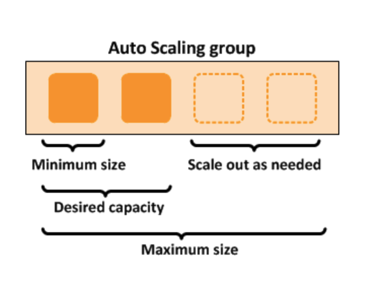

# Amazon Web Service
웹 또는 앱 서비스를 운영하다보면 클라이언트의 요청이 급격히 많아 지는 경우가 발생합니다. 만약 우리집에 있는 서버로 서비스를 운영하는 경우라면, 요청이 많아지는 순간 서버가 다운되거나 응답까지 지연이 발생하게 됩니다. 그렇다고 당장 용산에 달려가 여분의 서버를 사오는 것이 효율적일까요? 만약 요청이 많아지는 시기가 불규칙적이라면, 즉 특정 시간이나 특정 날짜에만 요청이 많아 지는 것이라면 여분의 서버는 대부분의 시간을 아무 연산도 안하고 방치될 가능성이 많습니다. 따라서 여분의 서버를 사는 것은 비효율적입니다.     
아마존 웹 서비스 (AWS)는 컴퓨팅 자원, 데이터 베이스, 저장 공간 등 다양한 클라우드 서비스를 제공합니다. 저번 시간에 알아본 컴퓨팅 자원 서비스 [AWS Computing 링크](https://christinarok.github.io/2022/07/09/aws.html)에 이어 이번에는 클라이언트의 요청 개수 또는 서버의 CPU 사용량에 따라 서버의 개수를 자동으로 늘려주는 오토 스케일링 (Auto Scaling) 서비스를 알아보겠습니다.

# Auto Scaling
...

## EC2 Auto Scaling Group
> EC2 컴퓨팅 서비스를 처음 들어보신 분이라면 [EC2 링크](https://christinarok.github.io/2022/07/09/aws.html#ec2)의 설명을 참고해주세요.

앞선 예시에서 클라이언트 요청 개수가 증가하면 서버를 추가해야한다고 설명했습니다. "클라이언트 요청 개수"를 서버 또는 서비스의 로드(Load)라고 합니다. 즉, 서버나 서비스가 처리해야 되는 일의 양을 말합니다. EC2 Auto Scaling Group은 EC2 인스턴스의 로드를 측정하고 로드가 많은 경우 자동으로 인스턴스를 추가하는 horizontal scaling을 실행합니다.    

EC2 서비스에서 여러 인스턴스를 사용하고 있다면, 인스턴스를 논리적 그룹으로 나눠 스케일링을 관리할 수 있습니다. 그룹 단위로 관리 및 설정이 가능하기 때문에 auto scaling group이라고 불립니다.    

그룹별로 최대(max), 최소(min), 최적(desired)의 인스턴스 개수를 설정할 수 있습니다.    

<figure>
  
</figure>

위의 예시 그룹은 최소 1개의 인스턴스, 최대 4개의 인스턴스, 그리고 최적으로 2개의 인스턴스를 설정했습니다. 따라서 해당 그룹의 인스턴스는 최소 1개의 인스턴스는 가지되, 보통 2개의 인스턴스를 가지며, 만약 로드가 증가하면 최대 4개의 인스턴스까지 증가할 수 있습니다. 따라서 서비스를 하는 중에 인스턴스가 오류로 중단되도(terminated) 자동으로 1개의 인스턴스가 다시 실행되기 때문에 어느 경우에도 적어도 1개의 인스턴스는 실행 중이라는 것을 장담할 수 있습니다.    

EC2 auto scaling group의 스케일링 정책(scaling policy)를 알아봅시다. 여기서 정책이란 인스턴스를 늘리고 줄일 기준, 즉 metric을 의미합니다. 스케일링 정책은 3가지로 나뉩니다.

- Manual
  - 최대, 최소, 최적의 인스턴스 개수만 설정합니다.
- Schedule 
  - 만약 서비스에 로드가 많아 지는 상황, 예를 들면 요청이 급격히 많아지는 시간대나 날짜를 알고 있는 상황일 경우 해당 시간대나 날짜에 스케일링이 되도록 설정할 수 있습니다. 
  - 예측 가능한 상황을 대비한다는 측면에서 proactive 방식이라고 부릅니다.
- Dynamic
  - Schedule과 달리 로드가 언제 증가할지 모르는 상황에서 적절한 CPU 사용률 등을 설정해놓는 방식입니다. 예를 들어 CPU 사용률을 50%대로 설정했다면 인스턴스의 CPU 사용률이 50% 이상으로 높아질 때 새로운 인스턴스가 실행됩니다. 
  - 예측 불가능 상황에 대처한다는 측면에서 reactive 방식이라고 부릅니다. 

EC2 Auto Scaling Group은 별도의 사용료가 없습니다. EC2, EBS(Storage) 그리고 모니터링 서비스인 CloudWatch 서비스의 사용료만 지불하면 별도의 추가 비용 없이 사용할 수 있습니다.     

## ELB (Elastic Load Balacer)

# Conclusion

# Reference
- [AWS Scaling Documentation](https://docs.aws.amazon.com/autoscaling/?id=docs_gateway)
- [AWS EC2 Auto Scaling Group](https://docs.aws.amazon.com/autoscaling/ec2/userguide/what-is-amazon-ec2-auto-scaling.html)
- [AWS Scaling Policy](https://docs.aws.amazon.com/autoscaling/ec2/userguide/scale-your-group.html#scaling-options)
